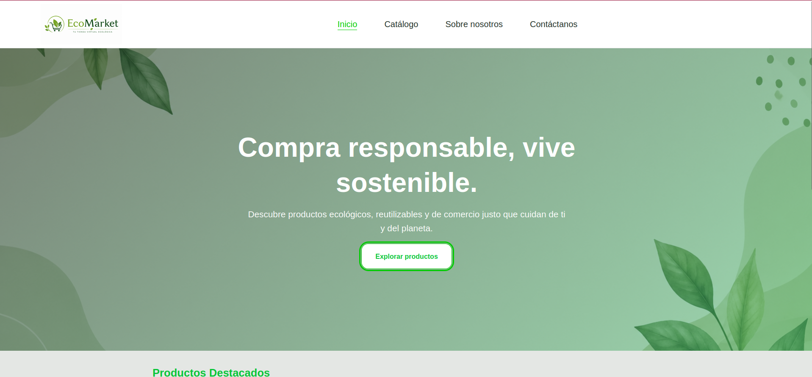
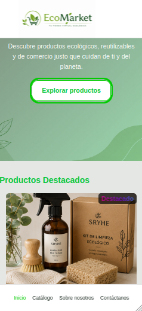
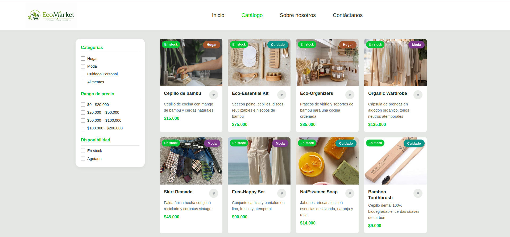
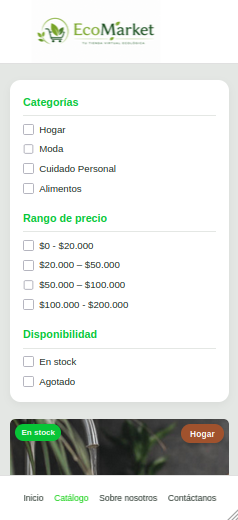
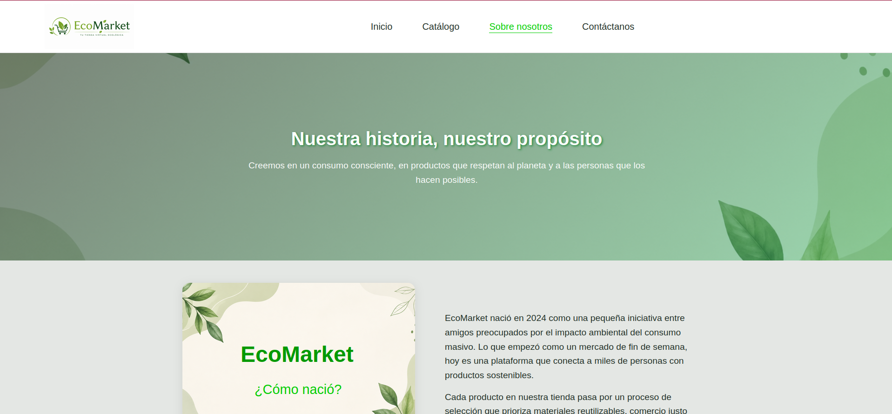
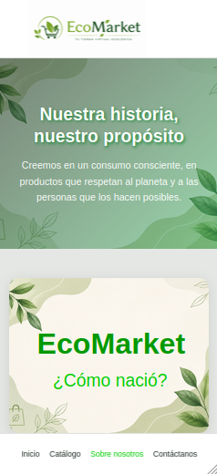
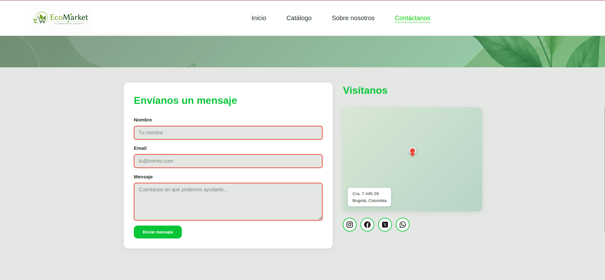
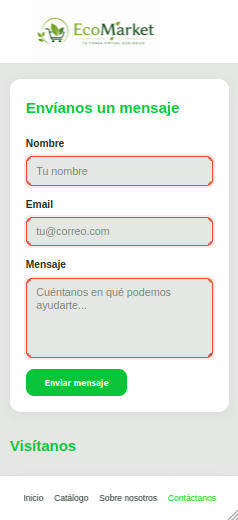

# EcoMarket

## Descripción del proyecto

EcoMarket es una tienda online dedicada exclusivamente a productos ecológicos, reutilizables y sustentables. La plataforma permite explorar un catálogo categorizado, conocer la misión de la marca, contactar al equipo y filtrar productos por categoría, precio y disponibilidad — todo construido con HTML5 y CSS3 puro, sin JavaScript.

Consta de 4 vistas: Inicio, Productos, Sobre Nosotros y Contacto, con un enfoque Mobile First y diseño visual basado en una paleta natural (verdes y tonos tierra).

---
## Instrucciones de visualización
**Opción 1 — Directo desde el navegador:**
Abrir index.html con Live Server (extensión de VS Code) o doble clic. Las rutas son absolutas (/css/...), así que un servidor estático es preferible.

**Opcion 2 - Vercel:**
Buscar la página con el enlace: "eco-market-jps.vercel.app" en el navegador.

Navegación: desde el header se accede a las 4 vistas (Inicio, Nuestros productos, Sobre nosotros, Contáctanos).

⚠️ Requiere un navegador con soporte para :has() — Chrome 105+, Firefox 121+, Safari 15.4+.

---

## Tecnologías utilizadas
Marcado	**HTML5 semántico**
**Estilos	CSS3** puro (Grid, Flexbox, Custom Properties)
Interactividad	Selectores CSS avanzados: **:has(), :target, :valid/:invalid, :checked, :hover, :focus, :active**
Animaciones	**@keyframes + transition**
Responsive	**Mobile First** con media queries en 720px y 1024px
Control de versiones	**Git + GitHub** (workflow con ramas feature/* y Conventional Commits)

Capturas de pantalla
| Sección | Vista Escritorio | Vista Móvil |
| :---: | :---: | :---: |
| **Inicio** | |  |
| **Productos** |  |  |
| **Nosotros** |  |  |
| **Contacto** |  |  |